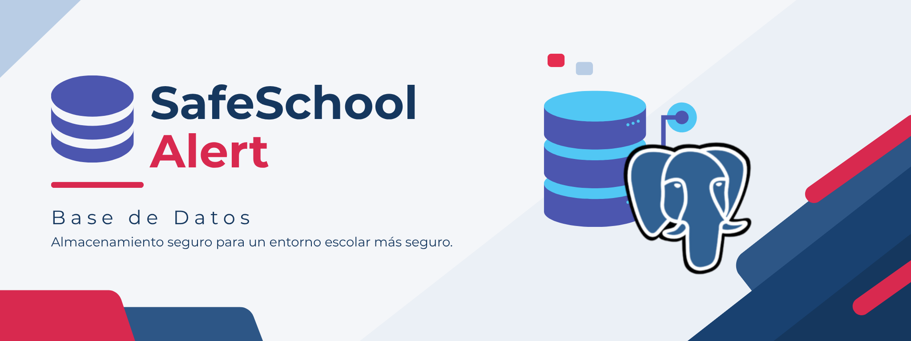
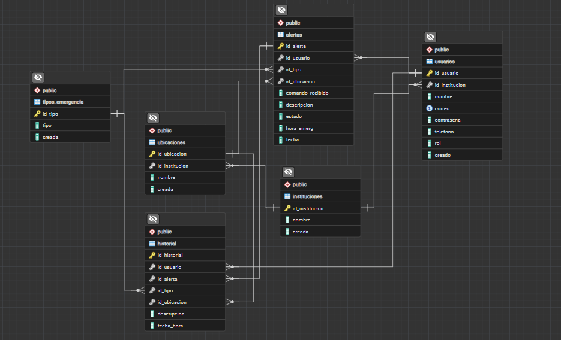

# SafeSchool Alert: Base de Datos

**Sistema inteligente de alertas y emergencias escolares**

Este repositorio contiene la estructura de la base de datos para el sistema **SafeSchool Alert**, incluidas las instrucciones necesarias para las consultas de datos, operaciones de manipulación, uniones de tablas y consultas SQL avanzadas diseñadas para recuperar los datos más precisos que el sistema utlizará.

---

## Descripción del proyecto

**SafeSchool Alert** es un sistema de alertas escolares diseñado para facilitar la comunicación y gestión de situaciones de emergencia dentro de una institución educativa.

El sistema integra una aplicación móvil desarrollada con **MIT App Inventor** y un sistema electrónico basado en **Arduino Uno**, permitiendo detectar, registrar y gestionar diferentes tipos de emergencias.

La base de datos desarrollada en **PostgreSQL** permite almacenar la información necesaria para el funcionamiento del sistema, incluyendo instituciones, usuarios, ubicaciones, tipos de emergencia, alertas e historial de emergencias detectadas.

---

## Base de datos

### Nombre de la base de datos

```text
safeSchool_alert
```

### Sistema gestor

```text
PostgreSQL
```

> [!NOTE]
> La base de datos fue desarrollada utilizando tablas relacionadas mediante **claves primarias y claves foráneas**, permitiendo mantener una estructura organizada para la información del sistema.

---

## Estructura de la base de datos

La base de datos está compuesta por las siguientes tablas:

| Tabla              | Descripción                                                            |
| ------------------ | ---------------------------------------------------------------------- |
| `instituciones`    | Almacena la información de las instituciones educativas registradas.   |
| `usuarios`         | Almacena los usuarios asociados a una institución.                     |
| `ubicaciones`      | Registra las diferentes ubicaciones dentro de una institución.         |
| `tipos_emergencia` | Contiene los tipos de emergencia que puede manejar el sistema.         |
| `alertas`          | Registra las emergencias y alertas generadas dentro de la institución. |
| `historial`        | Conserva el registro histórico de las alertas y eventos gestionados.   |

---

## Relaciones entre las tablas

La estructura de la base de datos permite relacionar la información mediante claves foráneas.


> [!NOTE]
> Diagrama Entidad-relación de la base de datos creada en el gestos de bases de datos PostgresSQL.

### Instituciones → Usuarios

Una institución puede tener diferentes usuarios registrados.

```text
La relación es de: 1 : N
```

La tabla `usuarios` utiliza `id_institucion` como clave foránea relacionada con `instituciones`.

---

### Instituciones → Ubicaciones

Cada ubicación pertenece a una institución determinada.

```text
La relación es de: 1 : N
```

La tabla `ubicaciones` utiliza `id_institucion` como clave foránea.

---

### Usuarios → Alertas

Una alerta puede estar asociada con el usuario que la genera o registra.

```text
La relación es de: 1 : N
```

La tabla `alertas` utiliza `id_usuario` como clave foránea.

---

### Tipos de emergencia → Alertas

Cada alerta está asociada a un tipo de emergencia.

```text
La relación es de: 1 : N
```

La tabla `alertas` utiliza `id_tipo` como clave foránea.

---

### Ubicaciones → Alertas

Cada alerta registra la ubicación donde ocurrió la emergencia.

```text
La relación es de: 1 : N
```

La tabla `alertas` utiliza `id_ubicacion` como clave foránea.

---

### Alertas → Historial

El historial conserva información relacionada con las alertas registradas.

```text
La relación es de: 1 : N
```

La tabla `historial` utiliza `id_alerta` como clave foránea.

---

## Tecnologías utilizadas

| Tecnología             | Uso                                                    |
| ---------------------- | ------------------------------------------------------ |
| **PostgreSQL**         | Sistema gestor de base de datos.                       |
| **pgAdmin 4**          | Administración y ejecución de consultas SQL.           |
| **Visual Studio Code** | Edición y organización de archivos del proyecto.       |
| **Git**                | Control de versiones del proyecto.                     |
| **GitHub**             | Almacenamiento del repositorio y trabajo colaborativo. |

El proyecto general SafeSchool Alert también utiliza **MIT App Inventor, Arduino Uno, C++, Bluetooth HC-05, CloudDB y Tinkercad** como parte de la aplicación y del sistema electrónico.

---

# Estructura del repositorio

La organización propuesta para los archivos de la base de datos es:

```text
SafeSchool-Alert-BD/
│
├── database/
│   ├── 01_scripts_estructura.sql
│   ├── 02_usuarios.sql
│   ├── 03_alertas.sql
│   └── 04_historial.sql
│
├── documentación/
│
├── evidencias/
│
├── README.md
│
└──
```

# Integrantes

### José Rolando Velasco Peña

---

### Luis Mario Meléndez Escobar

---

### Ulises de Jesus Mercado Alberto

---

## Instalación y Configuración

Para poder instalar el proyecto de forma local desde una máquina con conexión a Internet, ejecuta las siguientes líneas de comandos en PowerShell o Git Bash:

### 1. Prerrequisitos

Asegúrate de tener instalado lo siguiente en tu ordenador:

- [Git](https://git-scm.com)
- [Arduino IDE](https://docs.arduino.cc/software/ide/)

### 2. Clonar el repositorio

Luego, clona este repositorio en tu máquina local usando la terminal:

```bash
git clone https://github.com/joserolandovelascopena-code/SafeSchool-Alert-BD.git
```
