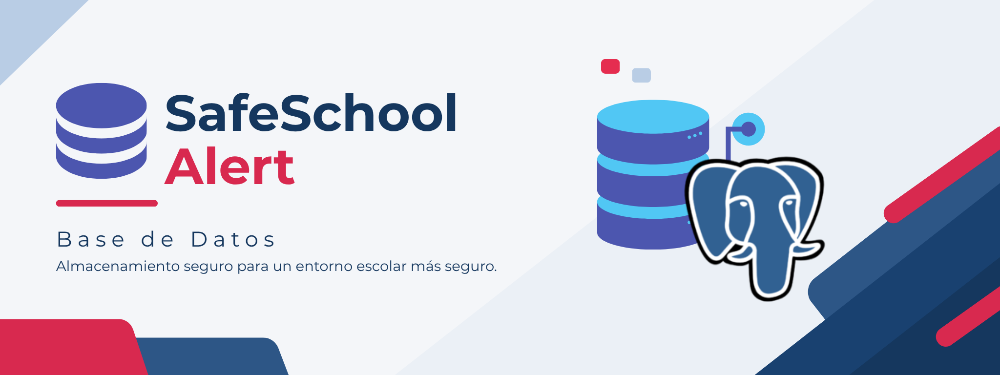
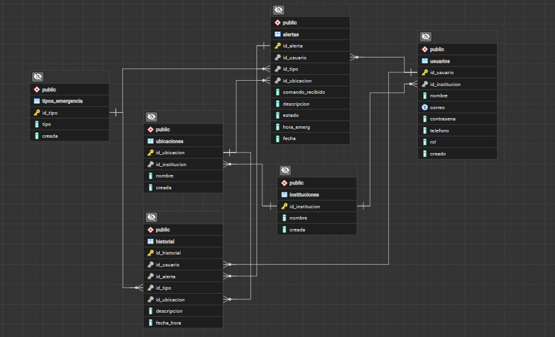

# SafeSchool Alert: Base de Datos

**Sistema inteligente de alertas y emergencias escolares**

Este repositorio contiene la estructura de la base de datos para el sistema **SafeSchool Alert**, incluidas las instrucciones necesarias para las consultas de datos, operaciones de manipulación, uniones de tablas y consultas SQL avanzadas diseñadas para recuperar los datos más precisos que el sistema utlizará.

---

# Tabla de contenido
- [SafeSchool Alert: Base de Datos](#safeschool-alert-base-de-datos)
- [Descripción del proyecto](#descripción-del-proyecto)
- [Base de datos](#base-de-datos)
  - [Nombre de la base de datos](#nombre-de-la-base-de-datos)
  - [Sistema gestor](#sistema-gestor)
- [Estructura de la base de datos](#estructura-de-la-base-de-datos)
- [Funciones de la aplicación y correspondencia App–BD](#funciones-de-la-aplicación-y-correspondencia-appbd)
- [Consultas principales](#consultas-principales)
- [Operaciones SQL relacionadas con la aplicación](#operaciones-sql-relacionadas-con-la-aplicación)
- [Seguridad](#seguridad)
- [Integrantes y responsabilidades](#integrantes-y-responsabilidades)
- [Relaciones entre las tablas](#relaciones-entre-las-tablas)
- [Tecnologías utilizadas](#tecnologías-utilizadas)
- [Estructura del repositorio](#estructura-del-repositorio)
- [Instalación y Configuración](#instalación-y-configuración)
  - [1. Prerrequisitos](#1-prerrequisitos)
  - [2. Clonar el repositorio](#2-clonar-el-repositorio)

## Descripción del proyecto

**SafeSchool Alert** es un sistema de alertas escolares diseñado para facilitar la comunicación y gestión de situaciones de emergencia dentro de una institución educativa.

El sistema integra una aplicación móvil desarrollada con **MIT App Inventor** y un sistema electrónico basado en **Arduino Uno**, permitiendo detectar, registrar y gestionar diferentes tipos de emergencias.

La base de datos desarrollada en **PostgreSQL** permite almacenar la información necesaria para el funcionamiento del sistema, incluyendo instituciones, usuarios, ubicaciones, tipos de emergencia, alertas e historial de emergencias detectadas.

---

## Base de datos

### Nombre de la base de datos

```text
safeSchool_alert
```

### Sistema gestor

```text
PostgreSQL
```

> [!NOTE]
> La base de datos fue desarrollada utilizando tablas relacionadas mediante **claves primarias y claves foráneas**, permitiendo mantener una estructura organizada para la información del sistema.

---

## Estructura de la base de datos

### Tablas principales

La base de datos está compuesta por las siguientes tablas:

| Tabla              | Descripción                                                            |
| ------------------ | ---------------------------------------------------------------------- |
| `instituciones`    | Almacena la información de las instituciones educativas registradas.   |
| `usuarios`         | Almacena los usuarios asociados a una institución.                     |
| `ubicaciones`      | Registra las diferentes ubicaciones dentro de una institución.         |
| `tipos_emergencia` | Contiene los tipos de emergencia que puede manejar el sistema.         |
| `alertas`          | Registra las emergencias y alertas generadas dentro de la institución. |
| `historial`        | Conserva el registro histórico de las alertas y eventos gestionados.   |

---

---

## Funciones de la aplicación y correspondencia App–BD

SafeSchool Alert utiliza información almacenada en PostgreSQL para realizar diferentes funciones dentro de la aplicación. La siguiente tabla muestra la relación entre las principales funciones de la aplicación móvil, las tablas de la base de datos y las operaciones SQL que serán necesarias para la aplicación pueda funcionar gestioanar cada una de las emergencias de forma correcta.

| Función de la aplicación                       | Tabla PostgreSQL   | Operación SQL   | Información utilizada                                                     |
| ---------------------------------------------- | ------------------ | --------------- | ------------------------------------------------------------------------- |
| Identificar usuario                            | `usuarios`         | SELECT          | Nombre, correo y rol del usuario                                          |
| Registrar una alerta                           | `alertas`          | INSERT          | Usuario, tipo de emergencia, ubicación, descripción, fecha, hora y estado |
| Consultar alertas                              | `alertas`          | SELECT          | Tipo de emergencia, ubicación, descripción, fecha, hora y estado          |
| Consultar tipos de emergencia                  | `tipos_emergencia` | SELECT          | Tipos de emergencia disponibles                                           |
| Consultar ubicaciones                          | `ubicaciones`      | SELECT          | Ubicación donde puede generarse una emergencia                            |
| Consultar y actualizar el estado de una alerta | `alertas`          | SELECT / UPDATE | Identificador y estado de la alerta                                       |
| Consultar historial de alertas                 | `historial`        | SELECT          | Emergencia, usuario, ubicación, descripción y fecha y hora                |

Estas operaciones representan la relación que tendría la aplicación con la base de datos durante una futura integración. La aplicación no se conectará directamente con PostgreSQL, sino que las solicitudes serán procesadas mediante una API o servicio web.

## Consultas principales

Acontinuación se presntan las consultas principales, para obtener información específica de las alertas, usuarios e historial de emergencias almacenados en PostgreSQL, que la aplicación móvil necesitara obtner para gstionar cada una de las emergencias de la institución educativa.

### Consulta de alertas con INNER JOIN Y LEFT JOIN

Esta consulta obtiene información completa de las alertas relacionando las tablas `alertas`, `usuarios`, `tipos_emergencia` y `ubicaciones`.

```sql

SELECT
    alertas.id_alerta,
    tipos_emergencia.tipo AS emergencia,
    ubicaciones.nombre AS ubicacion,
    usuarios.nombre AS usuario_atendio,
    alertas.descripcion AS descripcion,
    alertas.fecha AS dia_detectada,
    alertas.hora_emerg AS hora,
    alertas.estado
FROM public.alertas
LEFT JOIN public.usuarios
    ON alertas.id_usuario = usuarios.id_usuario
INNER JOIN public.tipos_emergencia
    ON alertas.id_tipo = tipos_emergencia.id_tipo
INNER JOIN public.ubicaciones
    ON alertas.id_ubicacion = ubicaciones.id_ubicacion;
```

### Consulta de alertas activas

Esta consulta permite identificar cuales son las emergencias que se encuentran activas dentro del sistema.

```sql
SELECT
    alertas.id_alerta,
    tipos_emergencia.tipo AS emergencia,
    ubicaciones.nombre AS ubicacion,
    usuarios.nombre AS usuario_atendio,
    alertas.descripcion AS descripcion,
    alertas.fecha AS dia_detectada,
    alertas.hora_emerg AS hora,
    alertas.estado
FROM public.alertas
LEFT JOIN public.usuarios
    ON alertas.id_usuario = usuarios.id_usuario
INNER JOIN public.tipos_emergencia
    ON alertas.id_tipo = tipos_emergencia.id_tipo
INNER JOIN public.ubicaciones
    ON alertas.id_ubicacion = ubicaciones.id_ubicacion
WHERE alertas.estado = 'ACTIVA';
```

### Consulta de usuarios

Permite consultar información de los usuarios registrados dentro de la institución ordenados alfabéticamente.

```sql
SELECT
   u.id_usuario,
   u.nombre,
   u.correo,
   u.rol,
   i.nombre AS institucion_del_usuario,
   u.creado AS creado_en
FROM public.usuarios u
INNER JOIN public.instituciones i ON u.id_institucion = i.id_institucion;


SELECT
   u.id_usuario,
   u.nombre,
   u.correo,
   u.rol,
   i.nombre AS institucion_del_usuario,
   u.creado AS creado_en
FROM public.usuarios u
INNER JOIN public.instituciones i ON u.id_institucion = i.id_institucion
ORDER BY u.creado DESC;
```

### Consulta del historial de emergencias

Esta consulta permite obtener los registros históricos relacionados con los ventos de cada una de las emrgencia detectadas en el sistema.

```sql
SELECT
    historial.id_historial,
    usuarios.nombre AS usuario,
    alertas.id_alerta,
    tipos_emergencia.tipo AS tipo,
    ubicaciones.nombre AS ubicacion,
    historial.descripcion AS descripcion,
    historial.fecha_hora AS fecha_y_hora
FROM public.historial
INNER JOIN public.usuarios
    ON historial.id_usuario = usuarios.id_usuario
INNER JOIN public.alertas
    ON historial.id_alerta = alertas.id_alerta
INNER JOIN public.tipos_emergencia
    ON historial.id_tipo = tipos_emergencia.id_tipo
INNER JOIN public.ubicaciones
    ON historial.id_ubicacion = ubicaciones.id_ubicacion

```

---

## Operaciones SQL relacionadas con la aplicación

Las funciones de SafeSchool Alert se relacionan con las operaciones SQL CRUD que la aplicación necesite utilizar para gestioanar cada emergencia.

### SELECT

Se utilizará cuando la aplicación necesite consultar información almacenada en PostgreSQL.

Algunos ejemplos son:

- Identificar un usuario.
- Consultar tipos de emergencia.
- Consultar ubicaciones.
- Consultar alertas.
- Consultar el historial de emergencias.

### INSERT

Se utilizará cuando la aplicación necesite registrar una nueva emergencia, usuario, institución, ubicación, tipo de emergencia, o un nuevo evento en historial en la base de datos.

La información registrada puede incluir:

- Usuario relacionado.
- Tipo de emergencia.
- Ubicación.
- Descripción.
- Fecha.
- Hora.
- Estado.

### UPDATE

Se utilizará cuando sea necesario modificar información de una alerta existente, principalmente su estado.

Por ejemplo cuando una alerta cambia de un estado "ACTIVA" a "ATENDIDA" al momento de que un usuario atiende la emergencia o cuando pasa ha proceso de atención.

### DELETE

La eliminación de alertas, emergencias, usuarios, historial etc. Almacenados en la base de datos del sistema cuando sea necesario la eliminación de registros.

---

## Seguridad

Para administrar el acceso a la base de datos se creó un usuario específico denominado `safeschool_user`, al cual se le asignaron permisos para conectarse a la base de datos del proyecto SafesSchool Alert, con permisos utilizar el esquema `public` y realizar operaciones SQL CRUD en las tablas del esquema `public`.

Los permisos implementados son:

| Permiso   | Descripción                                       |
| --------- | ------------------------------------------------- |
| `CONNECT` | Permite al usuario conectarse a la base de datos. |
| `USAGE`   | Permite utilizar el esquema `public`.             |
| `SELECT`  | Permite consultar información de las tablas.      |
| `INSERT`  | Permite registrar nueva información.              |
| `UPDATE`  | Permite modificar información existente.          |
| `DELETE`  | Permite eliminar información cuando corresponda.  |

### Usuario de base de datos

```text
Usuario: safeschool_user
Base de datos: safeschool_alert
Esquema: public
```

---

## Integrantes y responsabilidades

| Integrante                      | Responsabilidad       |
| ------------------------------- | --------------------- |
| José Rolando Velasco Peña       | Alertas y emergencias |
| Luis Mario Meléndez Escobar     | Historial de alertas  |
| Ulises de Jesus Mercado Alberto | Usuarios              |

### José Rolando Velasco Peña: Alertas y emergencias

Responsable de la creación de las funciones que se relacionan con el registro, consulta y gestión de los datos almacnados en la tabla alertas del proyecto.

### Luis Mario Meléndez Escobar: Historial

Responsable de los registros almacenados en la tabla historial de emergencias, sus consultas y la información de cada uno de los eventos de las emergencias.

### Ulises de Jesus Mercado Alberto: Usuarios

Responsable de la información almacenada de usuarios y consultas de datos de acceso, personales y de contacto, y la creación de las funciones de consulta de los datos de usuarios registrados en el sistema.

---

## Relaciones entre las tablas

La estructura de la base de datos permite relacionar la información mediante claves foráneas.



> [!NOTE]
> Diagrama Entidad-relación de la base de datos creada en el gestos de bases de datos PostgresSQL.

### Instituciones → Usuarios

Una institución puede tener diferentes usuarios registrados.

```text
La relación es de: 1 : N
```

La tabla `usuarios` utiliza `id_institucion` como clave foránea relacionada con `instituciones`.

---

### Instituciones → Ubicaciones

Cada ubicación pertenece a una institución determinada.

```text
La relación es de: 1 : N
```

La tabla `ubicaciones` utiliza `id_institucion` como clave foránea.

---

### Usuarios → Alertas

Una alerta puede estar asociada con el usuario que la genera o registra.

```text
La relación es de: 1 : N
```

La tabla `alertas` utiliza `id_usuario` como clave foránea.

---

### Tipos de emergencia → Alertas

Cada alerta está asociada a un tipo de emergencia.

```text
La relación es de: 1 : N
```

La tabla `alertas` utiliza `id_tipo` como clave foránea.

---

### Ubicaciones → Alertas

Cada alerta registra la ubicación donde ocurrió la emergencia.

```text
La relación es de: 1 : N
```

La tabla `alertas` utiliza `id_ubicacion` como clave foránea.

---

### Alertas → Historial

El historial conserva información relacionada con las alertas registradas.

```text
La relación es de: 1 : N
```

La tabla `historial` utiliza `id_alerta` como clave foránea.

---

## Tecnologías utilizadas

| Tecnología             | Uso                                                    |
| ---------------------- | ------------------------------------------------------ |
| **PostgreSQL**         | Sistema gestor de base de datos.                       |
| **pgAdmin 4**          | Administración y ejecución de consultas SQL.           |
| **Visual Studio Code** | Edición y organización de archivos del proyecto.       |
| **Git**                | Control de versiones del proyecto.                     |
| **GitHub**             | Almacenamiento del repositorio y trabajo colaborativo. |

El proyecto general SafeSchool Alert también utiliza **MIT App Inventor, Arduino Uno, C++, Bluetooth HC-05, CloudDB y Tinkercad** como parte de la aplicación y del sistema electrónico.

---

# Estructura del repositorio

La organización propuesta para los archivos de la base de datos es:

```text
SafeSchool-Alert-BD/
│
├── database/
│   ├── 01_scripts_estructura.sql
│   ├── 02_datos_prueba_alertas.sql
│   ├── 03_consultas_alertas.sql
│   ├── 02_datos_prueba_usuarios.sql
│   ├── 03_consultas_usuarios.sql
│   ├── 02_datos_prueba_historial.sql
│   ├── 03_consultas_historial.sql
│   └── 04_seguridad.sql
│
├── documentación/
│   └── 01_Modelo_Fisico.pdf
│
├── integracion/
│   ├── correspondencia_app_SafeSchool.pdf
│   └── diagrama_integracion.sql
│
├── modelo/
│   └── diagrama_modelo_fisico.png
│
├── evidencias/
│   ├── VELASCO_ROLANDO_SEMANA2.pdf
│   ├── MERCADO_ULISES_SEMANA2.pdf
│   ├── MELENDEZ_MARIO_SEMANA2.pdf
│   ├── MERCADO_ULISES_SEMANA3.pdf
│   ├── VELASCO_ROLANDO_SEMANA3.pdf
│   └── MELENDEZ_MARIO_SEMANA3.pdf
│
└── README.md

```

---

## Instalación y Configuración

Para poder instalar el proyecto de forma local desde una máquina con conexión a Internet, ejecuta las siguientes líneas de comandos en PowerShell o Git Bash:

### 1. Prerrequisitos

Asegúrate de tener instalado lo siguiente en tu ordenador:

- [Git](https://git-scm.com)
- [Arduino IDE](https://docs.arduino.cc/software/ide/)

### 2. Clonar el repositorio

Luego, clona este repositorio en tu máquina local usando la terminal:

```bash
git clone https://github.com/joserolandovelascopena-code/SafeSchool-Alert-BD.git
```

[def]: #
